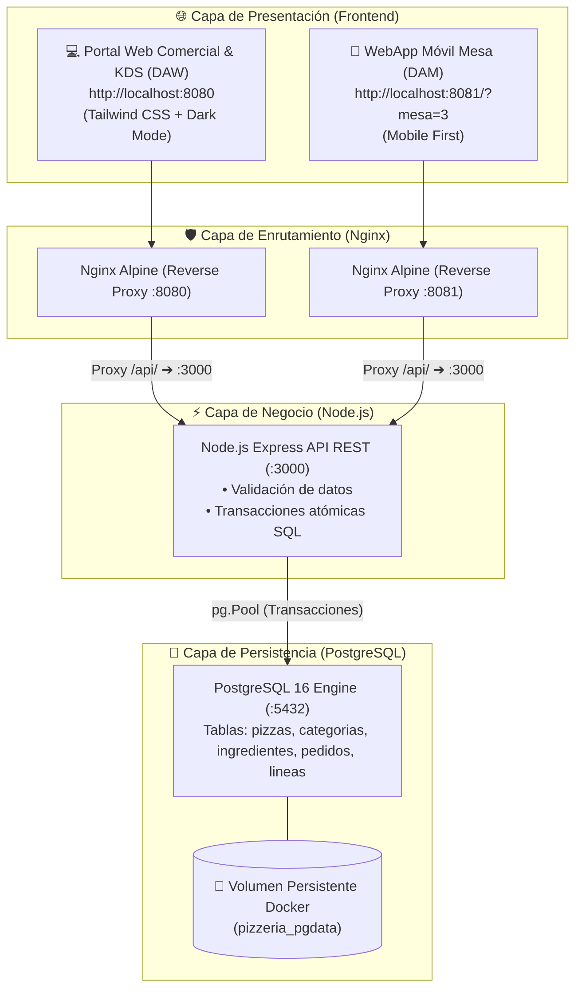

# 🍕 Pizzería Bella Napoli: Sistema Full-Stack Multi-Canal


Proyecto formativo de arquitectura web completa y despliegue de microservicios contenerizados.

---

## 🎯 ¿Qué es este proyecto y qué resuelve?

Es una plataforma completa de gestión para una pizzería artesanal que cubre todo el ciclo de vida de un pedido empresarial real:
1. **Clientes en Internet (B2C)**: Landing comercial con propuesta de valor, carta interactiva, pedidos a domicilio y para recoger con seguimiento en tiempo real (*Live Tracking*).
2. **Clientes en Salón Físico (QR)**: Acceso directo a la carta de mesa escaneando un código QR (`?mesa=3`).
3. **Personal de Cocina (KDS)**: Tablero Kanban interactivo para gestionar comandas (*Recibido ➔ En Horno ➔ En Reparto ➔ Entregado*).
4. **Administración y Caja (TPV)**: Creación de pedidos telefónicos/mostrador, gestión de mesas y altas/bajas del catálogo en PostgreSQL.

---

## 🏗️ Arquitectura y Fundamento Teórico



### 💡 Conceptos Teóricos Clave para Alumnos:
1. **¿Por qué Microservicios en Contenedores?**: Desacoplamos la base de datos, el backend y el frontend para que puedan escalar, actualizarse y reiniciarse de forma independiente sin afectar al resto.
2. **¿Por qué Nginx como Reverse Proxy?**: El navegador nunca habla directamente con Node.js en el puerto 3000. Nginx recibe la petición en el puerto 80/8080 y la redirige internamente a `/api/`, protegiendo el backend y optimizando la entrega con compresión **Gzip**.
3. **¿Por qué Transacciones Atómicas (`BEGIN / COMMIT / ROLLBACK`)?**: Al crear un pedido con varias pizzas, si falla la inserción de una línea, la base de datos revierte todo el proceso para evitar pedidos "fantasma" o incompletos.

---

## 🚀 Puesta en Marcha Rápida (1 Solo Comando)

### Requisitos Previos:
* Tener instalado **Docker Desktop** (en Windows/Mac) o **Docker Engine + Docker Compose** (en Linux).

### 1. Clonar el repositorio y configurar variables de entorno:
```bash
git clone https://github.com/tu-usuario/pizzeria-fullstack.git
cd pizzeria-fullstack

# Crear archivo de configuración a partir de la plantilla didáctica:
cp .env.example .env
```

### 2. Arrancar el proyecto en modo Desarrollo:
```bash
docker compose up -d --build
```

---

## 🌐 Puntos de Acceso en el Navegador

| Módulo / Interfaz | URL Local | Descripción y Credenciales |
| :--- | :--- | :--- |
| **🏠 Portal Web Comercial & Carta** | [http://localhost:8080](http://localhost:8080) | Portada para clientes, selección de pedidos a domicilio o recogida. |
| **🔥 Cocina KDS & Intranet** | [http://localhost:8080](http://localhost:8080) ➔ *Acceso Personal* | **PIN Cocinero:** `1111`<br/>**PIN Administrador:** `9999` |
| **📱 WebApp Móvil Mesa (QR)** | [http://localhost:8081/?mesa=3](http://localhost:8081/?mesa=3) | Simulación de comensal escaneando el QR de la **Mesa 3**. |
| **⚡ Diagnóstico de Salud API** | [http://localhost:8080/api/health](http://localhost:8080/api/health) | Comprobación de latencia y estado de PostgreSQL (`status: UP`). |
| **🍕 Catálogo de Pizzas JSON** | [http://localhost:8080/api/pizzas](http://localhost:8080/api/pizzas) | Datos crudos del catálogo servidos por la API REST. |

---

## 🧪 Flujo de Demostración Práctica para Clase

Para comprobar la sincronización en tiempo real:

1. **Abrir dos pestañas en el navegador**:
   - **Pestaña A (Cliente):** Entra a [http://localhost:8080](http://localhost:8080), ve a la Carta, añade 2 pizzas y pulsa en el carrito para pedir **A Domicilio**.
   - **Pestaña B (Cocina KDS):** Entra a [http://localhost:8080](http://localhost:8080), pulsa en **"🔐 Acceso Personal"**, introduce el **PIN `1111`** y accede a la pestaña **Cocina KDS**.
2. **Tramitar el pedido en la Pestaña A**:
   - Rellena nombre, teléfono y dirección. Pulsa **"🚀 Confirmar y Enviar Pedido"**.
   - Verás cómo la pantalla del cliente salta automáticamente al **Seguimiento en Vivo (Tracking)**.
3. **Despachar la comanda en la Pestaña B (Cocina)**:
   - La nueva comanda aparece al instante en la columna **"Nuevos / Pendientes"**.
   - Pulsa **"🔥 Meter al Horno"** ➔ La barra de seguimiento del cliente avanza a *En Preparación*.
   - Pulsa **"🛵 A Reparto"** ➔ La barra del cliente avanza a *En Reparto*.
   - Pulsa **"📦 Entregado"** ➔ El ciclo del pedido se completa con éxito.

---

## 🛠️ Endpoints de la API REST

### 🍕 Pizzas (`/api/pizzas`)
* `GET /api/pizzas`: Obtiene el catálogo completo con ingredientes y categorías.
* `GET /api/pizzas/:id`: Consulta una pizza específica por ID.
* `POST /api/pizzas`: Añade una nueva pizza al catálogo (Admin).
* `PUT /api/pizzas/:id`: Actualiza precio, descripción o disponibilidad.
* `DELETE /api/pizzas/:id`: Elimina una pizza de la carta.

### 📋 Pedidos (`/api/pedidos`)
* `GET /api/pedidos`: Lista todas las comandas con su desglose de líneas.
* `GET /api/pedidos/:id`: Consulta el estado de un pedido específico para seguimiento.
* `POST /api/pedidos`: Tramita una nueva comanda con transacción SQL atómica.
* `PUT /api/pedidos/:id/estado`: Actualiza el estado (`pendiente`, `en_preparacion`, `en_reparto`, `listo`, `servido`, `entregado`, `cancelado`).

### 🪑 Mesas (`/api/mesas`)
* `GET /api/mesas`: Consulta la ocupación y códigos QR de las 8 mesas del salón.
* `PATCH /api/mesas/:numero/estado`: Cambia el estado de la mesa (`libre`, `ocupada`, `reservada`).

---

## 📁 Estructura del Código Fuente

```text
pizzeria-fullstack/
├── backend/                  # API REST desacoplada (Node.js / Express ES Modules)
│   ├── src/
│   │   ├── config/db.js      # Pool de conexiones a PostgreSQL con variables de entorno
│   │   ├── controllers/      # Lógica de negocio (pizzas, pedidos multicanal, mesas)
│   │   ├── routes/           # Rutas REST (/api/pizzas, /api/pedidos, /api/mesas)
│   │   └── server.js         # Servidor Express con CORS, middlewares y healthcheck
│   ├── Dockerfile            # Imagen ligera Node.js 20 Alpine
│   └── package.json
├── frontend-web/             # Portal Web Comercial, Carta, KDS y Admin (DAW)
│   ├── src/
│   │   ├── index.html        # SPA interactiva 100% Tailwind CSS (Dark/Light mode)
│   │   └── main.js           # Lógica cliente, carrito, tracking y autenticación por PIN
│   ├── nginx.conf            # Servidor estático y Reverse Proxy hacia /api/
│   └── Dockerfile            # Imagen ligera Nginx Alpine
├── frontend-qr-app/          # WebApp Móvil para Clientes en Sala (DAM)
│   ├── src/                  # Interfaz táctil optimizada para lectura de mesa (?mesa=X)
│   ├── nginx.conf            # Servidor Nginx y Reverse Proxy
│   └── Dockerfile
├── database/
│   └── init.sql              # DDL (Tablas relacionales) y DML (Datos semilla y recetas)
├── docs/                     # 🔒 Documentación privada, guías y banco de prácticas (excluida de Git)
│   ├── indice_de_recursos_y_practicas.md
│   ├── guia_despliegue_produccion_proxmox_y_aws.md
│   ├── informe_auditoria_pruebas_e2e.md
│   └── practicas_01_a_05.md
├── docker-compose.yml        # Orquestación de desarrollo con Live Reload
├── docker-compose.prod.yml   # Orquestación de producción con puertos aislados
├── .env.example              # Plantilla documentada de variables de entorno
└── .gitignore                # Protección de secretos y documentos privados
```

---

## 📜 Buenas Prácticas de Ingeniería Aplicadas

* **Arquitectura Desacoplada (3 Capas)**: Separación estricta entre presentación, lógica de negocio y persistencia.
* **Seguridad por Aislamiento**: Base de datos y servidor de aplicaciones protegidos en redes internas sin exposición pública de puertos sensibles.
* **Transacciones Atómicas**: Integridad garantizada en base de datos ante operaciones compuestas (pedidos y líneas).
* **Gestión de Entornos**: Control de secretos mediante variables `.env` y configuración específica para desarrollo y producción.
* **Diseño Responsive & Accesibilidad**: Interfaz móvil adaptable sin dependencias pesadas de compilación.
* **Licencia**: MIT - Código abierto para propósitos formativos y profesionales.
